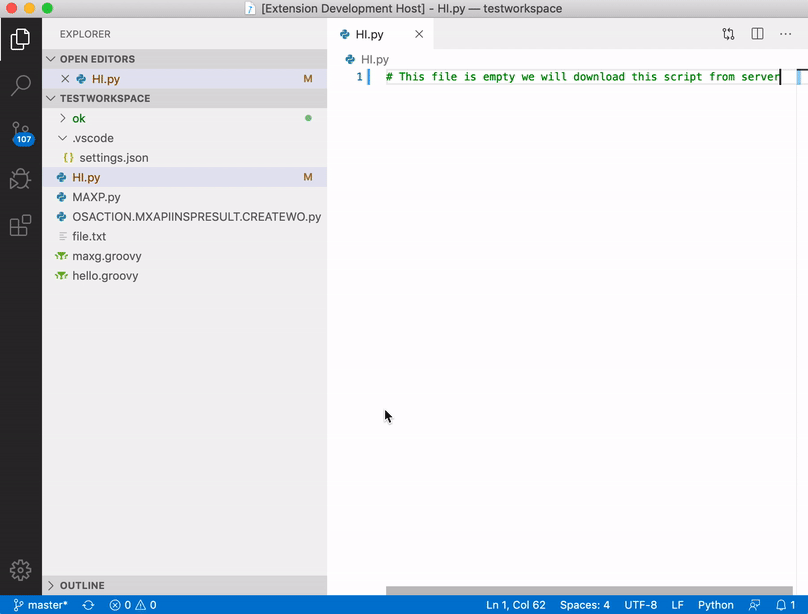
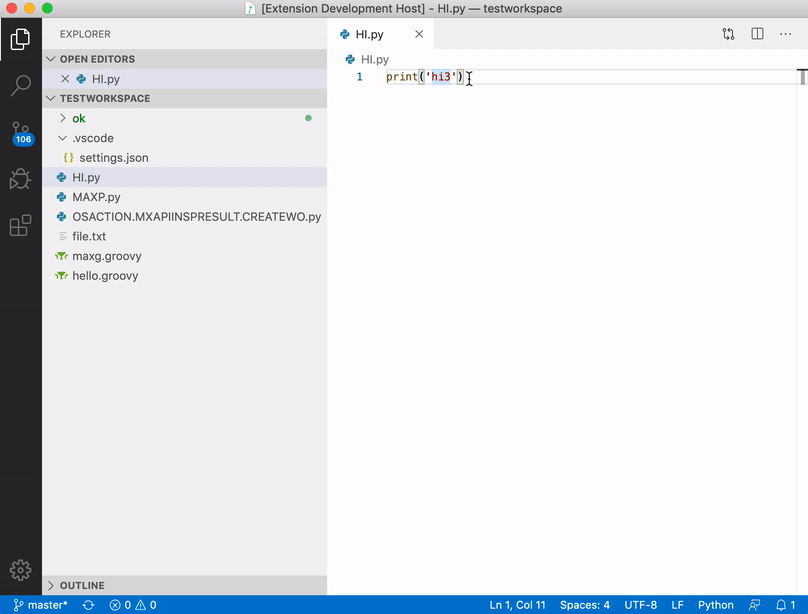
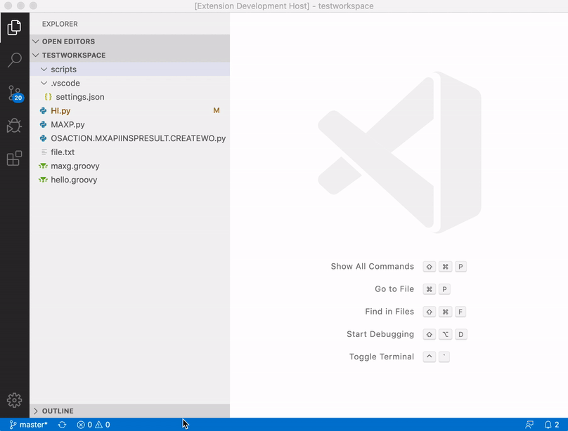
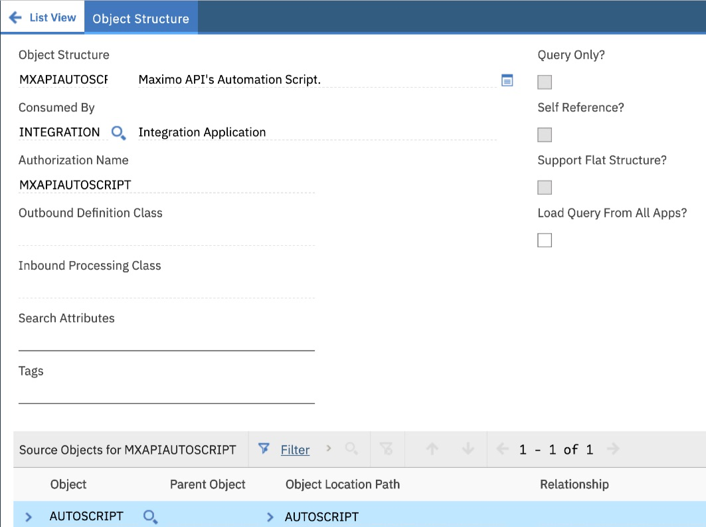
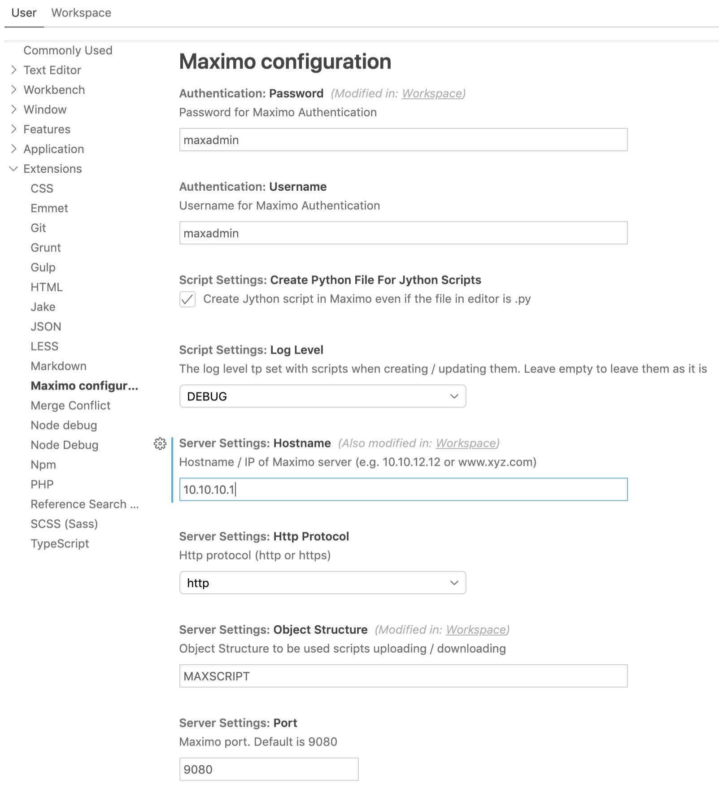

# MxScript 

A script manager for IBM Maximo / Control Desk. This allows simple management (upload / download / comparison) of scripts from with in vs code.

## Features

This was created to help developers using vs code to write scripts extensions for IBM Maximo / ICD. VS code already has excellent support for Java. see here
This adds the following four actions to vs code.

1. [Update Script from Server](#update-script-from-server)
2. [Compare Script with Server](#compare-script-with-server)
3. [Upload Script to Server](#upload-script-to-server)
4. [Download All Scripts from Server](#download-all-scripts-from-server)

### Update Script from Server

#### Activate
On command palette search and select this option

#### Functionality
You must have a saved file opened for this to work. This downloads the updated script from server for the opened tab. 

[Back to Top](#mxscript)

### Compare Script with Server

#### Activate
On command palette search and select this option

#### Functionality
You must have a saved file open for this to work. This downloaded the updated script for the opened tab. 

[Back to Top](#mxscript)

### Upload Script to Server

#### Activate
On command palette search and select this option

#### Functionality
You must have a saved file opened for this to work. This uploads the script from the opened tab to the server.

[Back to Top](#mxscript)

### Download All Scripts from Server

#### Activate
On command palette search and select this option

#### Functionality
This downloads all the scripts from Maximo server to the folder you selected.

[Back to Top](#mxscript)

## Requirements

You should have access to an instance of IBM Maximo / ICD to manage scripts.

#### Configuring Object Structure
You must have rights to use an object structure having `AUTOSCRIPT` as its base object. 
>There is an object structure `MXAPIAUTOSCRIPT` created by default. You can use it

If somehow your installation does not have this OS then follow the following steps to create an object structure. 
1. Goto Object Strcutures
2. Click on `New Object Structure`
3. Give it any name e.g. `MXAPIAUTOSCRIPT`. In Consumed by field enter `INTEGRATION`
4. In the source object table click on New Row. Then in that new row select `AUTOSCRIPT` in object field.
5. Save

It should be something like below

#### Configuring Object Structure Security
See below if your are getting this error

>Error 400: BMXAA9301E - The user of the transaction is not authorized for Object Structure {1}. Configure authorization in the object structure application and grant necessary access to the user

You can either turn off authentication for OS [Turn Off OS Authorization](https://www.ibm.com/support/pages/mif-object-structure-authorization)
or grant authorization for that specific OS [Grant OS Authorization](https://www.ibm.com/support/pages/using-object-structure-security-limit-access-security-groups)

## Extension Settings

Before using this extension you need to add a few settings. It's easier to edit these settings in Setting UI. 

Other than that you can also edit them in `settings.json` of your project.

This extension contributes the following settings:

* `mxscript.serverSettings.hostname`: Hostname / IP of Maximo server (e.g. 10.10.12.12 or www.yourmaximoserver.com)
* `mxscript.serverSettings.port`: Maximo port. Default is 9080
* `mxscript.serverSettings.httpProtocol`: Http protocol. Either `http` or `https`
* `mxscript.authentication.username`: Username for Maximo Authentication
* `mxscript.authentication.password`: Password for Maximo Authentication
* `mxscript.serverSettings.objectStructure`: Object Structure to be used scripts uploading / downloading. Default is `MXAPIAUTOSCRIPT`
* `mxscript.scriptSettings.createPythonFileForJythonScripts`: Create Jython script in Maximo even if the file in editor is .py. Helps in intellisense
* `mxscript.scriptSettings.logLevel`: The log level to set with scripts when creating / updating them. Possible values are `DEBUG,INFO,WARN,ERROR,FATAL`. Leave empty to leave them as it is

## Known Issues

If you encounter any bug then please open an issue at github [repository](https://github.com/ahmednrana/mxscript)

## Release Notes

First release I have added basic functions to this extension.

### 0.5.0

Initial release added upload, download, download all and compare with server functions.

**Contact** Feel free to reach me at [linkedin](https://www.linkedin.com/in/ranaahmed/) or [wordpress](https://maximomize.wordpress.com). I would love to meet fellow maximo consultants
>**Note:** This is work of third party and not an IBM official extension